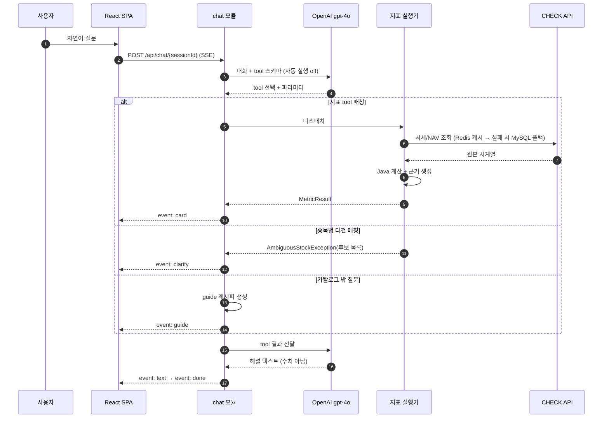

<div align="center">

# CHECK Kopilot

**자연어로 코스콤 CHECK API 금융 데이터를 조회 및 가공하는 AI 데이터 어시스턴트**

수치는 LLM이 아니라 백엔드가 계산하고, 그 근거를 항상 공개합니다.

<br/>


</div>

---

## 한눈에 보기

> 💬 **"삼성전자랑 코스피, 최근 한 달 수익률 갭 알려줘"**

| | |
|---|---|
| 🧠 **LLM은 해석만** | 지표 tool 선택 · 파라미터 추출 · 해설 텍스트까지만 담당 |
| ⚙️ **계산은 백엔드가** | CHECK API 호출과 모든 수치 계산은 백엔드 서버 로직이 수행 |
| 🔍 **근거는 항상 공개** | 호출 API · 원본 수치 · 공식 · 중간 계산값을 카드에 함께 제공 |
| 📊 **바로 쓸 수 있게** | 차트 렌더링 + 3시트 xlsx 다운로드 |

</br>

## 왜 만들었나

**① 원하는 지표가 화면에 없다** - 수익률 갭, ETF 괴리율, 변동성 비교 같은 2차 가공 데이터는 CHECK 단말기와 HTS/MTS의 정형 화면에 없습니다. 결국 원시 데이터를 내려받아 엑셀로 가공하거나 IT 부서에 요청해야 합니다.

**② 자연어로 가공까지 해주는 서비스가 없다** - 해외에는 BloombergGPT, Morgan Stanley AI Assistant가 있지만, 국내 자본시장 데이터를 자연어로 조회하고 2차 가공까지 수행하는 서비스는 아직 없습니다.

**③ 그런데 LLM에 계산을 맡길 수는 없다** - 금융에서 환각은 곧 잘못된 투자 판단입니다. 「금융분야 AI 가이드라인」(2026.06 시행) 역시 보조수단성과 신뢰성(설명가능성)을 요구합니다.

> 그래서 **LLM은 자연어 해석까지만**, **계산은 백엔드가**, **근거는 항상 함께** 제시하는 구조를 택했습니다.

</br>

## 주요 기능

### ① 자연어 데이터 조회 (NL2API)

API 구조나 파라미터를 몰라도 평소 쓰는 말로 물어보면 됩니다. LLM이 질문에서 지표와 종목, 기간을 뽑아내면 백엔드가 종목 마스터에서 종목명을 코드로 바꾼 뒤 CHECK API를 호출합니다.


</br></br>

### ② 지표 답변 카드

카드 위쪽에는 백엔드가 계산한 핵심 수치가, 아래쪽에는 Recharts 차트(line, bar)가 붙습니다. 카드에 찍히는 숫자는 전부 백엔드 JSON을 그대로 렌더한 값입니다. LLM이 쓴 해설 문구가 어떻든 수치는 항상 검증된 값으로 남습니다.


</br></br>

### ③ 근거 패널

근거 패널을 펼치면 호출한 CHECK API와 명세 링크, 원본 시세 데이터, 적용한 공식, 중간 계산값이 모두 나옵니다. 카드에 적힌 숫자를 직접 따라 계산해 확인하실 수 있습니다.


</br></br>


### ④ 종목 되묻기

"삼성"처럼 종목이 특정되지 않으면 임의로 고르지 않습니다. 삼성전자, 삼성전기, 삼성SDS를 칩 버튼으로 띄우고, 하나를 누르면 질문을 다시 쓸 필요 없이 그대로 답변으로 이어집니다.


</br></br>


### ⑤ 가이드(레시피) 카드

카탈로그에 없는 지표를 물어보면 답할 수 없다고 끝내지 않고 가이드 모드로 넘어갑니다. 어떤 CHECK API가 필요한지 명세 링크와 함께 알려주고, 호출 파라미터와 조합해서 계산하는 방법까지 레시피로 정리해 줍니다. 직접 구현하시거나 개발 부서에 그대로 전달하시면 됩니다. 카드 아래 "카탈로그 추가 요청" 버튼을 누르면 어떤 지표를 먼저 만들어야 할지 판단할 데이터로 쌓입니다.

</br></br>


### ⑥ Excel(xlsx) 내보내기

카드마다 Apache POI로 3시트 엑셀 파일을 만듭니다. 결과 요약, 원본 데이터, 계산 과정 순서입니다. 매번 손으로 하던 엑셀 작업이 버튼 하나로 끝납니다.

</br></br>

### ⑦ 컴플라이언스 가드레일

투자 판단이나 권유, 전망은 만들지 않습니다. 대신 사실에 기반한 지표를 제안하는 쪽으로 돌립니다. 화면 아래에는 고지 문구가 항상 붙어 있습니다.

</br></br>

### ⑧ 튜토리얼

처음 들어온 분을 위해 튜토리얼를 준비했습니다. 


</br></br>

## 제공 지표 카탈로그 7종

| # | 지표 | 질문 예시 | 계산 |
|---|---|---|---|
| 1 | 수익률 갭 | "삼성전자랑 코스피, 최근 한 달 수익률 갭" | 두 대상의 기간 수익률 차이 |
| 2 | 변동성 비교 | "에코프로랑 에코프로비엠 변동성 비교" | 일간수익률 표준편차, 연율화 |
| 3 | 괴리율 | "TIGER 미국S&P500 괴리율" | ETF 시장가 vs NAV(iNAV) |
| 4 | 이동평균 이격도 | "카카오 20일선 이격도" | 현재가 / N일 이동평균 − 1 |
| 5 | 상대수익률 랭킹 | "에코프로, 엘앤에프, 포스코퓨처엠 3개월 수익률 순위" | 복수 종목 기간 수익률 정렬 |
| 6 | 기간 시세 요약 | "현대차 올해 최고가·최저가·수익률" | 기간 OHLC 집계 |
| 7 | 누적수익률 | "네이버 최근 3개월 누적수익률 차트" | 일별 누적수익률과 기간 최고·최저 |


</br>

## 시스템 아키텍처
</br>


<details>
<summary><b>요청 처리 흐름 (시퀀스 다이어그램)</b></summary>

<br/>

사용자 질문은 **① 지표 답변 카드 / ② 종목 되묻기 / ③ 가이드 레시피** 세 갈래로 분기하며, 어떤 흐름에서도 수치 계산은 백엔드가 수행합니다.



**에러·가드레일** — 실행기는 검증만 하고 되묻기는 LLM에 맡깁니다. `MetricException`(`PERIOD_INVERTED`, `DATA_INSUFFICIENT` 등)과 `AmbiguousStockException`을 던지면 디스패처가 구조화 에러로 LLM에 되돌려주고 LLM이 자연어로 되묻습니다. **백엔드는 잘못된 계산 결과를 내지 않습니다.**

</details>

</br></br>

## 인프라 아키텍처

네이버 클라우드 플랫폼(FIN 리전)에 Terraform으로 VPC·NKS·DB를 프로비저닝하고, GitHub Actions self-hosted runner가 이미지를 NCR에 푸시한 뒤 매니페스트 태그를 갱신하는 **GitOps** 방식으로 배포합니다.
</br></br>


</br></br>

## 기술스택

| 분류 | 기술 스택 |
|------|----------|
| 공통 |     |
| FE |       |
| BE |      |
| AI |    |
| Database |   |
| External API |    |
| Test |     |
| Infrastructure |  -326CE5?logo=kubernetes&logoColor=white)    |
| Collaboration Tools |     |
</br>

## 프로젝트 구조

```
check-kopilot/
├─ backend/                   Spring Boot — 패키지 = 모듈
│  └─ .../kopilot/
│     ├─ checkapi/            CHECK 클라이언트 · 캐시/폴백 · 종목명→코드
│     ├─ domain/              카드 스키마(MetricResult) · 계산 유틸 · 예외
│     ├─ catalog/             지표 실행기 7종 + CatalogService
│     ├─ export/              CardStore · POI xlsx
│     ├─ chat/                수동 tool 루프 · 디스패처 · SSE · 익명 세션
│     ├─ guide/               F코드 사전 · API 역인덱스 · 레시피 생성
│     └─ demand/              추가요청 적재 · Admin 집계
├─ frontend/                  React 19 + Vite + Tailwind + Recharts
│  └─ src/
│     ├─ components/chat/cards/   IndicatorAnswerCard · EvidencePanel · ChartPanel
│     │                            GuideRecipeCard · ClarificationCard · KeyMetricsPanel
│     ├─ components/tour/         제품 투어
│     ├─ admin/                   Admin 수요 대시보드
│     └─ lib/                     SSE 클라이언트 · 세션 · 대화 저장 · 컴플라이언스
├─ infra/terraform/           NCP VPC · NKS · DB · ACG
├─ k8s/                       backend / frontend Deployment · Service
└─ docker-compose.yml         MySQL 8 · Redis 7
```

</br>

## 팀 소개

|                                       전진혁                                       |                                     심재성                                      |                                    박준상                                    |                                    최예빈                                    |                                    이승형                                    |
|:-------------------------------------------------------------------------------:|:------------------------------------------------------------------------------:|:---------------------------------------------------------------------------:|:---------------------------------------------------------------------------:|:---------------------------------------------------------------------------:|
|  |  |  |  |  |
|          [@Jeon-Jinhyeok](https://github.com/Jeon-Jinhyeok)          |          [@simjaesung](https://github.com/simjaesung)          |            [@ehgkals](https://github.com/ehgkals)            |            [@beenvyn](https://github.com/beenvyn)            |            [@SHL0915](https://github.com/SHL0915)            |
|                                     AI 개발                                      |                                   Back-end                                    |                                  Back-end                                   |                                  Front-end                                  |                                 Cloud Infra                                 |
