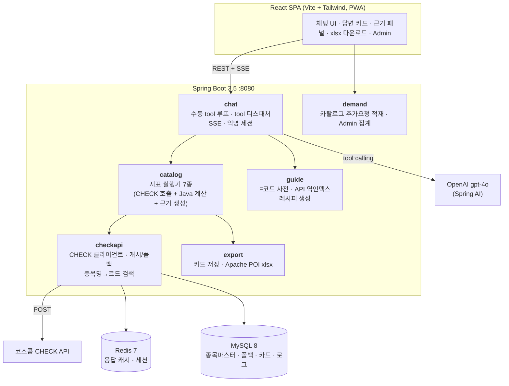
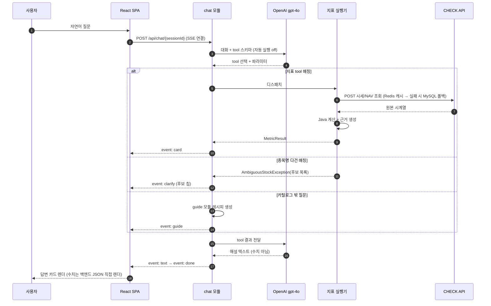

# CHECK Kopilot

> 자연어로 코스콤 CHECK API 금융 데이터를 조회·가공하는 AI 데이터 어시스턴트

트레이더가 채팅창에 "삼성전자랑 코스피, 최근 한 달 수익률 갭 알려줘"라고 입력하면, LLM은 **지표 tool을 고르고 파라미터만 뽑고** 실제 CHECK API 호출과 수치 계산은 **백엔드 Java**가 수행한다. 결과는 핵심 수치·차트·근거 패널(호출 API·원본 수치·공식·중간 계산값)·xlsx 다운로드가 붙은 답변 카드로 돌아온다.

코스콤 미니프로젝트(해커톤) 3팀 산출물.

<!-- [그림] 서비스 대표 화면 / 히어로 이미지 — docs/images/hero.png -->

---

## 1. 프로젝트 배경

### 1.1 금융 실무자의 2차 가공 데이터 접근성 문제

트레이더(TR), 펀드매니저(PM), 리서치 애널리스트(RA)는 수익률 갭, ETF 괴리율, 변동성 비교와 같은 **2차 가공 데이터**를 수시로 필요로 한다. 그러나 CHECK 단말기와 기존 HTS/MTS는 *미리 정의된 화면과 지표*를 조회하는 방식이라 원하는 가공 데이터를 바로 확인하기 어렵다. 실무자는 결국 원시 데이터를 내려받아 엑셀로 수식을 걸거나, IT 부서·개발 인력에 별도 요청해야 한다.

### 1.2 자연어 기반 금융 데이터 활용 서비스의 부재

생성형 AI 확산으로 자연어 질의·응답은 새로운 사용자 인터페이스로 자리 잡았다. 해외에서는 BloombergGPT, Morgan Stanley AI Assistant 등이 빠르게 확산되고 있지만, 국내 자본시장 데이터 영역에서 **자연어로 조회하고 2차 가공까지 수행**하는 서비스는 부족하다.

### 1.3 금융 업무 적용을 가로막는 AI 환각 리스크

금융 업무에서 AI의 환각은 단순 오답이 아니라 잘못된 투자 판단으로 직결된다. 특히 수익률 갭·괴리율처럼 원본을 가공해 산출하는 지표는 LLM이 그럴듯한 수치를 만들어내도 사용자가 오류를 인지하기 어렵다. 2026년 6월 시행된 「금융분야 AI 가이드라인」도 AI 활용 7대 원칙에 **보조수단성**(현 단계의 AI는 업무 보조수단으로 활용)과 **신뢰성**(결과에 대한 설명가능성 확보)을 포함했다.

> 따라서 LLM에 수치 산출까지 맡기는 대신, **LLM의 역할을 자연어 해석과 API 호출 변환으로 한정**하고 실제 계산은 백엔드가 수행한 뒤 **그 근거를 함께 제시**하는 구조가 필요하다. 이것이 CHECK Kopilot의 설계 출발점이다.

---

## 2. 필요성 및 기대효과

### 2.1 금융 실무자 — 데이터 조회·가공 업무 효율화

API 호출 → 데이터 수집 → 엑셀 가공의 반복 작업을 **자연어 요청 한 번**으로 대체한다. 데이터 준비에 쓰던 시간을 분석과 의사결정에 재투자할 수 있고, 개발 지식이 없는 실무자도 IT 부서 의존 없이 CHECK 데이터를 직접 활용할 수 있다.

### 2.2 금융기관 — 신뢰 가능한 금융 AI 활용 기반

금융권 생성형 AI 도입의 가장 큰 장벽은 환각으로 인한 오정보 리스크다. 본 서비스는 **수치 계산을 백엔드에서 수행**하고 **사용된 API·원본 데이터·공식·중간 계산값을 공개**하는 구조로 이 리스크를 구조적으로 차단한다. 결과 검증이 필수인 금융 실무 환경에서 AI를 실제 업무에 적용하기 위한 최소 요건을 충족한다.

### 2.3 코스콤 — CHECK API 생태계 확대

현재 CHECK API는 개발 역량을 갖춘 고객만 활용할 수 있어 잠재 수요 대비 저변이 제한적이다. CHECK Kopilot은 **비개발자까지 API 사용자층을 넓히는 진입 채널**로 작동한다. 종량제 과금 구조에서 사용량 증가는 곧 CHECK API 매출 증가이며, White-label 공급 시 증권사·금융기관은 AI 데이터 조회 기능을 자체 개발 대비 적은 비용·기간으로 도입할 수 있다.

**수익 모델(로드맵)** — ① API Gateway 종량제 과금, ② White-label 라이선스(MTS/HTS·사내 시스템 임베드)

---

## 3. 목표

| # | 목표 | 달성 방식 |
|---|---|---|
| 1 | **비개발 인력의 금융 데이터 접근성 향상** | 자연어 질의만으로 지표 조회·가공. 종목명이 모호하면 되묻고, 결과는 차트·xlsx로 즉시 활용 |
| 2 | **자연어 기반 금융 데이터 활용 환경 조성** | LLM tool calling으로 CHECK API를 자동 선택·호출. White-label / API Gateway B2B 모델의 기반 |
| 3 | **신뢰할 수 있는 AI 기반 조회 환경 구축** | 계산은 백엔드 Java가 수행하고, 호출 API·원본 수치·공식·중간값을 카드에 항상 공개 |

### 지켜야 할 설계 원칙 (변경 금지)

1. **모든 수치 계산은 백엔드 Java가 한다.** LLM은 tool 선택·파라미터 추출·해설 텍스트만 담당하며, LLM이 생성한 텍스트의 수치는 카드에 쓰지 않는다.
2. **지표 답변에는 근거를 공개한다.** 호출 API + 명세 링크, 원본 수치, 공식, 중간 계산값 — 4가지 모두. 선택 항목이 아니라 계약이다.
3. **투자 판단·권유·전망을 생성하지 않는다.** "지금 사야 돼?" 같은 질문은 사실 기반 지표 제안으로 전환한다.
4. 화면 하단 고지 문구 상시 노출: *"본 자료는 AI가 시장 데이터 기반으로 생성한 정보성 자료이며 투자권유가 아닙니다."*

### MVP 범위

- 지표 카탈로그 **7종** + 카탈로그 밖 질문용 **가이드(레시피) 모드**
- 데모 종목 풀 13종목(`stock-master.csv`가 원천)
- 로그인 인증 제외 — 브라우저 발급 UUID로 익명 세션만 격리

---

## 4. 시스템 설계

### 4.1 아키텍처



**핵심 설계 판단**

- **범용 NL2SQL/NL2API가 아니라 tool calling.** 임의 질문 → 임의 API 조합은 검증·정확성 보장이 어려워 배제했다. 지표 하나 = tool 하나로 고정하면 계산 결과를 단위 테스트로 검증할 수 있다.
- **Spring AI의 자동 tool 실행은 끈다**(`internalToolExecutionEnabled=false`). 자동 실행이 켜지면 tool 실행 도중 SSE로 카드 이벤트를 밀어낼 훅이 사라지므로, 수동 tool 루프를 직접 돌린다.
- **`CheckApiClient` 데코레이터 체인** — `CachingCheckApiClient(RestCheckApiClient, RedisCacheStore, JdbcFallbackStore)`. Redis hit이면 외부 호출을 생략하고, CHECK API 장애 시 MySQL `check_fallback` 스냅샷으로 폴백해 데모를 살린다.
- **카드 스키마 1종(`MetricResult`)** — 프론트는 이 JSON을 그대로 렌더한다. 지표를 추가해도 프론트 작업이 없다.

**지표 카탈로그 7종**

| # | 지표 | 질문 예시 | 계산 |
|---|---|---|---|
| 1 | 수익률 갭 | "삼성전자랑 코스피, 최근 한 달 수익률 갭" | 두 대상(종목/지수)의 기간 수익률 차이 |
| 2 | 변동성 비교 | "에코프로랑 에코프로비엠 변동성 비교" | 일간수익률 표준편차, 연율화 |
| 3 | 괴리율 | "TIGER 미국S&P500 괴리율" | ETF 시장가 vs NAV(iNAV) |
| 4 | 이동평균 이격도 | "카카오 20일선 이격도" | 현재가 / N일 이동평균 − 1 |
| 5 | 상대수익률 랭킹 | "에코프로, 엘앤에프, 포스코퓨처엠 3개월 수익률 순위" | 복수 종목의 기간 수익률 정렬 |
| 6 | 기간 시세 요약 | "현대차 올해 최고가·최저가·수익률" | 기간 OHLC 집계 |
| 7 | 누적수익률 | "네이버 최근 3개월 누적수익률 차트" | 일별 누적수익률과 기간 최고·최저 |

> 지표 7종 중 6종이 CHECK API `/stock/m001/hist_info` 하나로 커버된다(`F15301`로 ETF 괴리율까지).

### 4.2 인프라 아키텍처

네이버 클라우드 플랫폼(FIN 리전) 위에 Terraform으로 VPC·NKS 클러스터·DB를 프로비저닝하고, GitHub Actions self-hosted runner가 이미지를 NCR에 푸시한 뒤 매니페스트 태그를 갱신하는 GitOps 방식으로 배포한다.

<!-- [그림] 인프라 아키텍처 다이어그램 — docs/images/infra-architecture.png -->

```
GitHub (prod 브랜치 push)
   └─ GitHub Actions (self-hosted runner)
        ├─ docker build → NCP Container Registry (NCR)
        └─ k8s 매니페스트 image 태그 커밋 (GitOps)
             └─ NCP Kubernetes Service (NKS, FKR-1)
                  ├─ kopilot-backend (Deployment + Service)
                  ├─ kopilot-frontend (Deployment + Service)
                  └─ Private Subnet / LB Subnet (Cilium)
```

### 4.3 사용 기술

| 구분 | 기술 |
|---|---|
| **Frontend** | React 19, Vite 8, Tailwind CSS 4, Recharts 3, lucide-react, vite-plugin-pwa, Vitest + Testing Library, oxlint |
| **Backend** | Java 21, Spring Boot 3.5.3 (Web / JDBC / Data Redis), Spring AI 1.0.0, Apache POI 5.3 (xlsx), JUnit 5 |
| **AI** | OpenAI `gpt-4o` — tool calling (자동 실행 off + 수동 루프) |
| **Data** | MySQL 8.4 (종목 마스터·카드·대화 로그·CHECK 폴백), Redis 7 (응답 캐시·세션 컨텍스트) |
| **External API** | 코스콤 CHECK API (엔드포인트 776건 조사, F코드 사전 1,841개) |
| **Infra / DevOps** | NCP VPC·NKS·NCR, Terraform, Docker, Kubernetes, GitHub Actions (CI/CD, GitOps) |

---

## 5. 개발 결과

### 5.1 시스템 흐름도

사용자 질문은 단일 채팅 화면에서 **① 지표 답변 카드 / ② 종목 확인(되묻기) / ③ 가이드(레시피) 카드** 세 가지 흐름으로 분기한다. 어떤 흐름에서도 수치 계산은 LLM이 아닌 백엔드가 수행한다.



**에러·가드레일 흐름** — 실행기는 검증만 하고 되묻기는 LLM에 맡긴다. `MetricException`(`PERIOD_INVERTED`, `DATA_INSUFFICIENT` 등)과 `AmbiguousStockException`을 던지면 tool 디스패처가 구조화 에러로 LLM에 되돌려주고, LLM이 자연어로 되묻는다. **백엔드는 잘못된 계산 결과를 내지 않는다.**

### 5.2 기능 설명

#### ① 자연어 데이터 조회 (NL2API)

API 구조나 파라미터를 몰라도 자연어만으로 요청한다. LLM이 지표·종목·기간을 추출하고, 백엔드가 종목 마스터에서 종목명을 코드로 해석해 CHECK API를 호출한다.

<!-- [그림] 채팅 입력 & 예시 질문 화면 — docs/images/feature-chat.png -->

#### ② 지표 답변 카드 — 핵심 수치·차트

카드 상단에는 백엔드가 계산한 핵심 수치(headline)가, 아래에는 Recharts 차트(line/bar)가 붙는다. **카드의 모든 수치는 LLM 텍스트가 아니라 백엔드 JSON을 직접 렌더한 값**이라, 해설 문구와 무관하게 항상 검증된 값이 유지된다.

<!-- [그림] 지표 답변 카드(핵심 수치 + 차트) — docs/images/feature-answer-card.png -->

#### ③ 근거 패널 — 결과 검증

접이식 근거 패널에 ⓐ 호출한 CHECK API와 명세 링크, ⓑ 원본 시세 데이터, ⓒ 적용 공식, ⓓ 중간 계산값이 모두 담긴다. 사용자는 카드의 수치를 직접 재현·검증할 수 있다.

<!-- [그림] 근거 패널 펼친 화면 — docs/images/feature-evidence.png -->

#### ④ 종목 되묻기 (Clarification)

"삼성"처럼 모호한 입력은 임의로 추측하지 않는다. 후보 종목(삼성전자·삼성전기·삼성SDS)을 칩 버튼으로 띄우고, 클릭 한 번이면 재입력 없이 답변 카드로 이어진다.

<!-- [그림] 종목 되묻기 칩 화면 — docs/images/feature-clarify.png -->

#### ⑤ 가이드(레시피) 카드 — 거절 대신 안내

카탈로그에 없는 지표를 물으면 거절하는 대신 **가이드 모드**로 전환한다. 필요한 CHECK API 목록(명세 링크 포함), 호출 파라미터, 조합·계산 방법을 레시피로 제시해 사용자가 직접 또는 개발 부서를 통해 구현할 수 있게 한다. 하단의 "카탈로그 추가 요청" 버튼은 향후 지표 확장의 우선순위 데이터로 축적된다.

<!-- [그림] 가이드 레시피 카드 — docs/images/feature-guide.png -->

#### ⑥ Excel(xlsx) 내보내기

카드마다 Apache POI로 3시트 xlsx를 생성한다 — **결과 요약 / 원본 데이터 / 계산 과정**. 반복적인 엑셀 수작업을 버튼 하나로 대체한다.

<!-- [그림] xlsx 다운로드 결과 파일 — docs/images/feature-xlsx.png -->

#### ⑦ 컴플라이언스 가드레일

투자 판단·권유·전망은 생성하지 않고 사실 기반 지표 제안으로 전환한다. 화면 하단에는 고지 문구가 상시 고정 노출된다.

<!-- [그림] 투자 판단 요청 대응 + 하단 고지 문구 — docs/images/feature-compliance.png -->

#### ⑧ 제품 투어 & Admin 수요 대시보드

첫 방문자를 위한 6단계 제품 투어(`ProductTour`)를 제공하며, `#/admin` 경로에서 카탈로그 추가 요청과 사용 통계를 집계해 확인할 수 있다(공유 시크릿으로 보호).

<!-- [그림] 제품 투어 / Admin 대시보드 — docs/images/feature-tour-admin.png -->

### 5.3 HTTP API

| # | Method | Path | 통신 | 설명 |
|---|---|---|---|---|
| 1 | POST | `/api/chat/{sessionId}` | **SSE** | 자연어 질문 → `card`/`clarify`/`guide`/`text`/`done`/`error` 이벤트 스트리밍 |
| 2 | DELETE | `/api/chat/{sessionId}` | REST | 새 대화 — 서버 대화 컨텍스트 폐기 |
| 3 | GET | `/api/cards/{cardId}/xlsx` | REST(파일) | 카드 3시트 xlsx 다운로드 |
| 4 | POST | `/api/catalog-requests` | REST | 카탈로그 추가요청 적재 |
| 5 | GET | `/api/admin/demand/summary` | REST | 관리자 수요 요약 |
| 6 | GET | `/api/admin/stats` | REST | 관리자 통계 |

전체 스키마는 [`docs/api.md`](../docs/api.md)가 정본이다.

---

## 6. 실행 방법

### 6.1 사전 요구사항

| 항목 | 버전 | 비고 |
|---|---|---|
| JDK | 21 | Gradle toolchain이 자동 해석 |
| Node.js | 20 이상 | 프론트엔드 |
| Docker / Docker Compose | 최신 | MySQL·Redis 기동용 |
| OpenAI API 키 | — | 채팅 tool 루프에 필요 |
| CHECK API 인증정보 | — | `cust_id`, `auth_key`. 없으면 `fixture` 프로파일로만 기동 |

### 6.2 환경 설정

`.env.example`을 복사해 값을 채운다. `.env`는 gitignore 대상이라 커밋되지 않으며, `backend/build.gradle`이 `bootRun` 실행 시 이 파일을 읽어 환경변수로 주입한다.

```bash
cd check-kopilot
cp .env.example .env
```

```dotenv
# OpenAI (ChatGPT) API 키 — 채팅 tool 루프에 사용
OPENAI_API_KEY=sk-...

# CHECK API 인증 정보 — 미설정 시 fixture 프로파일로만 기동 가능
CHECK_CUST_ID=
CHECK_API_KEY=

# Admin 수요조사 API 보호용 공유 시크릿 (미설정 시 kopilot-demo)
ADMIN_TOKEN=
```

> **주의** — `cust_id` / `auth_key` / API 키는 절대 커밋하지 않는다.

### 6.3 인프라 기동 (MySQL + Redis)

```bash
cd check-kopilot
docker compose up -d
```

- MySQL 8.4 → `localhost:3307` (DB `kopilot` / 계정 `kopilot`·`kopilot`)
- Redis 7 → `localhost:6379`

스키마(`schema.sql`)는 백엔드 기동 시마다 `IF NOT EXISTS`로 실행되고, `StockMasterLoader`가 `stock-master.csv`를 upsert한다. **csv가 종목 마스터의 원천**이므로 csv를 고치면 기존 DB에도 반영된다.

### 6.4 백엔드 실행

```bash
cd check-kopilot/backend

./gradlew bootRun                                      # 실 CHECK API (기본 프로파일)
SPRING_PROFILES_ACTIVE=fixture ./gradlew bootRun       # 픽스처 데이터로 기동 (CHECK 키 불필요)
SPRING_PROFILES_ACTIVE=smoke ./gradlew bootRun         # 실 API 4건 호출 후 콘솔 출력하고 종료
```

`http://localhost:8080`에서 기동한다.

| 프로파일 | 동작 |
|---|---|
| 기본 | 실 CHECK API + Redis 캐시 + MySQL 폴백 |
| `fixture` | `FixtureCheckApiClient`가 `classpath:fixtures/*.json`을 읽는다 |
| `smoke` | `SmokeRunner`가 실 API 4건을 호출해 대조 출력 후 종료 |

### 6.5 프론트엔드 실행

```bash
cd check-kopilot/frontend
npm install
npm run dev
```

`http://localhost:5173`에서 뜨고, `/api` 요청은 Vite dev 서버가 `http://localhost:8080`으로 프록시한다. 관리자 화면은 `http://localhost:5173/#/admin?k=<ADMIN_TOKEN>`.

### 6.6 테스트 / 빌드

```bash
# 백엔드
cd check-kopilot/backend
./gradlew test                                    # 전체 (SpringBootTest가 있어 MySQL·Redis 필요)
./gradlew test --tests '*ReturnGapExecutorTest'   # 실행기·계산 테스트는 인프라 불필요
./gradlew build

# 프론트엔드
cd check-kopilot/frontend
npm test          # Vitest
npm run lint      # oxlint
npm run build
```

### 6.7 배포 (NCP)

```bash
cd check-kopilot/infra/terraform
terraform init
terraform plan
terraform apply    # NCP FIN 리전에 VPC · NKS 클러스터 · DB 프로비저닝
```

애플리케이션은 `prod` 브랜치 push 시 GitHub Actions가 자동 배포한다 — 이미지를 NCR에 푸시하고 `k8s/*/deployment.yaml`의 태그를 갱신·커밋하는 GitOps 흐름이다. 매니페스트는 [`k8s/`](k8s/)에 있다.

---

## 7. 프로젝트 구조

```
check-kopilot/
├─ backend/                     Spring Boot — 패키지 = 모듈
│  └─ src/main/java/com/koscom/kopilot/
│     ├─ checkapi/              CHECK API 클라이언트, 캐시·폴백, 종목명→코드 검색
│     ├─ domain/                카드 스키마(MetricResult), 계산 유틸, MetricException
│     ├─ catalog/               지표 실행기 7종 + CatalogService
│     ├─ export/                CardStore, Apache POI xlsx 생성
│     ├─ chat/                  수동 tool 루프, tool 디스패처, SSE, 익명 세션
│     ├─ guide/                 F코드 전역 사전 + API 역인덱스 기반 레시피 생성
│     └─ demand/                카탈로그 추가요청 적재 + Admin 집계
├─ frontend/                    React 19 + Vite + Tailwind + Recharts
│  └─ src/
│     ├─ components/chat/cards/ IndicatorAnswerCard · EvidencePanel · ChartPanel · GuideRecipeCard · ClarificationCard
│     ├─ components/tour/       제품 투어
│     ├─ admin/                 Admin 수요 대시보드
│     └─ lib/                   SSE 클라이언트, 세션, 대화 저장, 컴플라이언스
├─ infra/terraform/             NCP VPC · NKS · DB · ACG
├─ k8s/                         backend / frontend Deployment · Service
└─ docker-compose.yml           MySQL 8 · Redis 7
```

### 지표를 추가하려면

1. `catalog`에 `MetricExecutor` 구현 클래스를 작성한다 (`toolName` / `description` / `inputSchemaProperties` / `requiredParams` / `execute`)
2. `CatalogConfig`에 `@Bean`으로 등록한다
3. `FixtureCheckApiClient`용 픽스처를 추가한다
4. 엑셀로 손계산한 기대값과 대조하는 테스트를 작성한다

카드 스키마가 1종이므로 **프론트 작업은 없다.**

---

## 8. 문서

| 문서 | 내용 |
|---|---|
| [`docs/spec.md`](../docs/spec.md) | 설계 스펙 — 지표 카탈로그 7종, 아키텍처, UX, 가드레일, 데모 시나리오 |
| [`docs/plan.md`](../docs/plan.md) | 구현 계획 Task 1~20 — 파일·인터페이스·Step별 코드 전문 |
| [`docs/api.md`](../docs/api.md) | HTTP API 계약 정본 |
| [`docs/check-api/README.md`](../docs/check-api/README.md) | CHECK API 조사 결과 — F코드 사전 1,841개, 엔드포인트 776건 |
| [`.github/CONTRIBUTING.md`](../.github/CONTRIBUTING.md) | 협업 규칙 — 이슈·브랜치·커밋·PR 컨벤션 |

---

## 9. 팀 구성

| 이름 | 역할 |
|---|---|
| 전진혁 | AI 개발 |
| 심재성 | 백엔드 개발 |
| 박준상 | 백엔드 개발 |
| 최예빈 | 프론트엔드 개발 |
| 이승형 | 클라우드 인프라 구축 |

---

> 본 자료는 AI가 시장 데이터 기반으로 생성한 정보성 자료이며 투자권유가 아닙니다.
